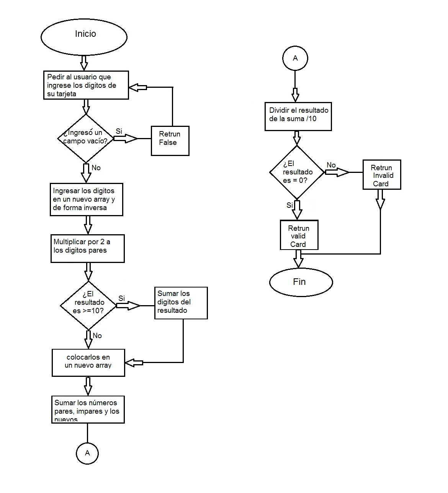

## CREDIT CARD TEST
1. Pedir al usuario los digitos de su tarjeta
2. Verificar si el usuario no ingreso un campo vacío, si no lo hizo continuar, de lo contrario enviar un mensaje de "error: no se aceptan espacios, vuelve a intentarlo" y volver al inicio
3. Colocar los número ingresados a un nuevo array y en orden inverso con .reverse()
4. multiplicar por 2 los digitos de la tarjeta que son pares.
5. los que resultaron >= 10 van a sumar los digitos de su resultado Ej. 6(digito) 6x2=12 (12>=10) se suma 1+2=3 (3 es el resultado y sustituira al 6)
6. Sumar todos los numeros sean pares e impares, los nuevo y viejos.
7. Del resultado de la suma debemos dividirlo entre 10 y si el modulo es 0 entonces es VADLIDA cualquier otro resultado debe retornar INVALIDA.
8. Fin

